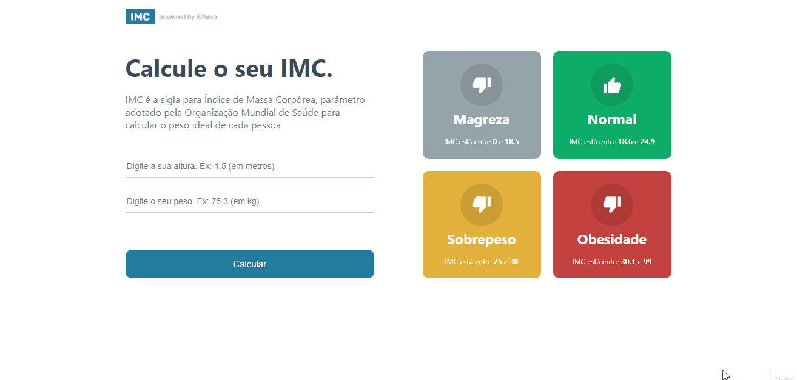

<h1 align="center">
    IMC
</h1>

## 📃 Sobre

Calculadora de IMC utilizada para verificar se alguém está ou não com o peso ideal. Ela aponta se o peso está adequado ou se está abaixo ou acima do peso.

---

## 🚀 Tecnologias utilizadas

O projeto foi desenvolvido com as seguintes tecnologias:

- React
- TypeScript

---

## 📷 Imagens

<h1 align="center">
    
</h1>

## 📁 Como baixar o projeto

```bash

    # Clonar o repositório
    $ git clone https://github.com/EnzoXavier1001/calculadora-imc

    # Entrar no diretório
    $ cd calculadora-imc

    # Baixar dependências
    $ yarn install

    # Executar o comando
    $ yarn dev

```